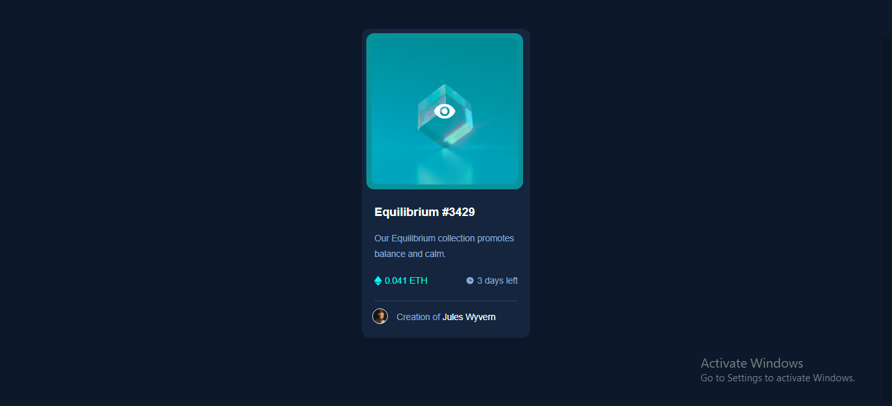

# Frontend Mentor - NFT preview card component solution

This is a solution to the [NFT preview card component challenge on Frontend Mentor](https://www.frontendmentor.io/challenges/nft-preview-card-component-SbdUL_w0U). Frontend Mentor challenges help you improve your coding skills by building realistic projects. 

## Table of contents

- [Overview](#overview)
  - [The challenge](#the-challenge)
  - [Screenshot](#Screenshot)
  - [Links](#links)
- [My process](#my-process)
  - [Built with](#built-with)
  - [What I learned](#what-i-learned)
  - [Continued development](#continued-development)
  - [Useful resources](#useful-resources)
- [Author](#author)
- [Acknowledgments](#acknowledgments)


## Overview

### The challenge

Users should be able to:

- View the optimal layout depending on their device's screen size.
- See hover states for interactive elements.

### Screenshot


### Links

- Solution URL: [Check out the solution Page](https://www.frontendmentor.io/solutions/nft-preview-card-using-html-css-animation-and-flex-box-H7jJAWyv0F)
- Live Site URL: [Live site URL](https://nft-preview-card-192.netlify.app/)

## My process

### Built with

- Semantic HTML5 markup.
- Flexbox.
- Mobile-first workflow.
- CSS Animations.

### What I learned
Coding this challenge expand my knowledge more on the css animation property.
### Below are the CSS coding sippets that help me achieve the overlay animation effect when hovering.
```CSS
.overlay::before{
    content: "";
    position: absolute;
    background-color: var(--Cyan);
    opacity: .5;
    border-radius: 1rem;
    width: 100%;
    height: 100%;
    inset: 0;
    display: none;
}
.overlay::after{
    content: "";
    position: absolute;
    inset: 0;
    background-image: url(./images/icon-view.svg);
    width: 100%;
    height: 100%;
    background-repeat: no-repeat;
    background-position: 50%;
    display: none;
}
.img_container:hover .overlay::before, .img_container:hover .overlay::after{
    display: block;
    animation: scaling .5s ease-in-out forwards;
}
@keyframes scaling{
    from{
        transform: scale(0);
    }
    to{
        transform: scale(1);
    }
}
```

### Continued development
Currently, i'v not yet mastered the CSS animatitions, i will continue to learn more about it. 

### Useful resources

- [Saad Hisham Solution on frontendmentor.io](https://www.frontendmentor.io/profile/Saad-Hisham) - This helped me to achieve the scaling effect on hovering. I really liked his pattern of approach.

## Author

- Twitter - [@opeyemi_Js](https://www.twitter.com/opeyemi_Js)

## Acknowledgments

I give credits to Saad Hisham, his solution to this same challenge really helped out.

[](https://app.netlify.com/sites/nft-preview-card-192/deploys)
